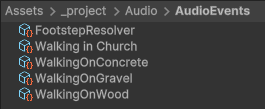
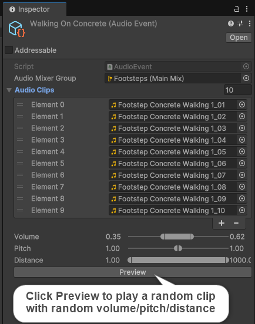
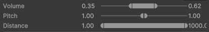
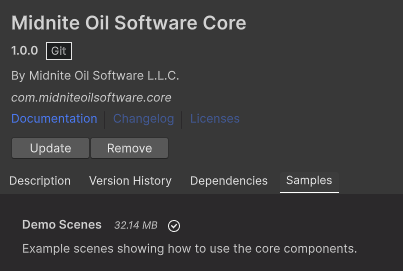

# Core Components for Midnite Oil Software Projects
## Installation Instructions

### Install via Unity Package Manager
1. Open Unity and go to `Window > Package Manager`.
2. Click the "+" button and choose `Add package from git URL`.
3. Enter the following URL: https://github.com/Midnite-Oil-Software-L-L-C/unity_packages.git?path=/Core

## Components in this package
### Create Default Folders
After installing the Core package you should see a Create Default Folders menu item under Midnite Oil Software > Core.<br>
<br>
This will create the following folders in your project:<br>
<br>

---
### SingletonMonoBehaviour
[SingletoneMonoBehaviour.cs](https://github.com/Midnite-Oil-Software-L-L-C/unity_packages/blob/main/Core/Runtime/SingletonMonoBehaviour.cs)<br>
Generic class used to implement the singleton pattern. Great for classes that need to persist between scene loads and be accessed from anywhere (e.g. game managers).<br>
#### Sample singleton monobehaviour class:
```csharp
    public class SettingsManager : SingletonMonoBehaviour<SettingsManager>
    {
        public string GetSetting(string key, string defaultValue)
        {
            _settings.TryAdd(key, defaultValue);
            return _settings[key];
        }

        public void SetSetting(string key, string value, bool save = false)
        {
            _settings[key] = value;
            if (save) SaveSettings();
        }
    }
```
---
### Settings Manager
[SettingsManager.cs](https://github.com/Midnite-Oil-Software-L-L-C/unity_packages/blob/main/Core/Runtime/Settings/SettingsManager.cs)<br>
Helper class for saving and loading settings. Uses PlayerPrefs to save settings to disk.<br>
#### Sample usage:
```csharp
void Start()
{
    var setting = SettingsManager.Instance.GetSetting("MySetting", "Default Value");
    Debug.Log(setting);
}

void OnDisable()
{
    SettingsManager.Instance.SetSetting("MySetting", "New Value", true);
}    
```
---
### AudioSettings
[AudioSettings.cs](https://github.com/Midnite-Oil-Software-L-L-C/unity_packages/blob/main/Core/Runtime/Settings/AudioSettings.cs)<br>
Uses the SettingsManager to save and load audio settings.
---
### EventBus
[EventBus.cs](https://github.com/Midnite-Oil-Software-L-L-C/unity_packages/blob/main/Core/Runtime/EventBus/EventBus.cs)<br>
Decouple components by using the EventBus to send and receive events.
#### Sample event (use structs to avoid creating garbage on the heap)
```csharp
    public struct MyEvent
    {
        public string Message { get; }
        
        public MyEvent(string message)
        {
            Message = message;
        }
    }
```
#### Subscribe to an event
```csharp
    void OnEnable()
    {
        EventBus.Instance.Subscribe<MyEvent>(OnMyEvent);
    }

    void OnMyEvent(MyEvent e)
    {
        Debug.Log(e.Message);
    }
```
#### Unsubscribe from an event
```csharp
    void OnDisable()
    {
        EventBus.Instance.Unsubscribe<MyEvent>(OnMyEvent);
    }
```
---
### Timer Manager
[TimerManager.cs]("https://github.com/Midnite-Oil-Software-L-L-C/unity_packages/blob/main/Core/Runtime/TimerManager.cs")<br>
The timer manager allows you to create timers that will trigger events when they complete. They are a nice alternative to Coroutines.
#### Sample usage:
```csharp
    Timer _refreshTimer;
    void Start()
    {
        StartRefreshTimer();    
    }
    
    void OnDisable()
    {
        StopRefreshTimer();
    }
    
    void StartRefreshTimer()
    {
        _refreshTimer = TimerManager.Instance.CreateTimer<CountdownTimer>(1.5f);
        _refreshTimer.OnTimerStop += RefreshDisplay;
        _refreshTimer.Start();
    }
    
    void RefreshDisplay()
    {
        Debug.Log("Refresh Display");
        _refreshTimer.Start();
    }    
    
    void StopRefreshTimer()
    {
        _refreshTimer.OnTimerStop -= RefreshLobbies;
        _refreshTimer.Stop(false);
    }    
```
---
### AudioEvent ScriptableObject
[AudioEvent.cs](https://github.com/Midnite-Oil-Software-L-L-C/unity_packages/blob/main/Core/Runtime/Audio/AudioEvent.cs)<br>
The AudioEvent is a collection of audio clips with random ranges for volume, pitch and distance. You can create an AudioEvent for every sound effect in your game. Each AudioEvent is assigned to an AudioMixerGroup.<br>
Simply call Play on the AudioEvent to play a random clip from the collection of clips with a random volume/pitch/distance based on the ranged parameters.<br>

<br>
The AudioEventEditor (custom editor) adds a preview button where you can test the event in the editor.<br>

---
### Music Manager
[MusicManager.cs](https://github.com/Midnite-Oil-Software-L-L-C/unity_packages/blob/main/Core/Runtime/Music/MusicManager.cs)<br>
Smoothly transition between music clips, music clip groups and music mixes. The MusicManager shuffles clips from the selected music clip group. The MusicManager is a SingletonMonoBehaviour so it persists between scene loads.

#### Music Clip Groups
[MusicClipGroup.cs](https://github.com/Midnite-Oil-Software-L-L-C/unity_packages/blob/main/Core/Runtime/Music/MusicClipGroup.cs)<br>
A MusicClipGroup is a collection of MusicClips. The MusicManager will shuffle clips from the selected MusicClipGroup.<br>

#### Music Mixes
[MusicMix.cs](https://github.com/Midnite-Oil-Software-L-L-C/unity_packages/blob/main/Core/Runtime/Music/MusicMix.cs)<br>
Music mixes are used to transition between music clips using their associated audio snapshots. The MusicManager will fade out the current clip and fade in the next clip. The MusicManager will shuffle clips from the selected MusicClipGroup.<br>
<br>
<br>
<br>
---
### RangedFloat / MinMaxRangeAttribute with RangedFloatDrawer.
Useful for min/max fields.
#### Sample usage:
```csharp
[SerializeField] [MinMaxRange(0, 1)] RangedFloat _volume = new RangedFloat(1, 1);
[SerializeField] [MinMaxRange(0, 2f)] RangedFloat _pitch = new RangedFloat(1, 1);
[SerializeField] [MinMaxRange(0f, 1000f)] RangedFloat _distance = new RangedFloat(1, 1000);
```
<br>
---
## Samples
After installing the Core package you can navigate to the Samples tab and install a demo scene that demonstrates how to use the features of the Core package.<br>


