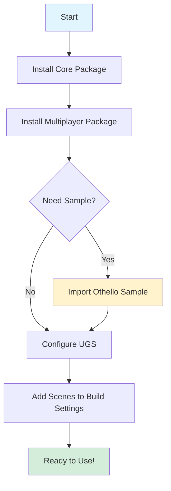
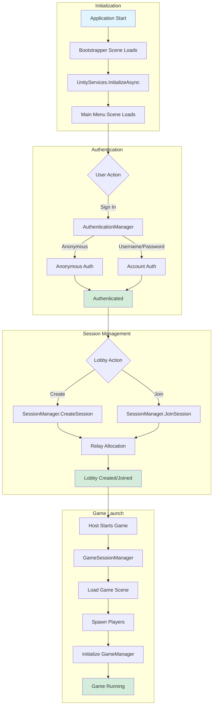
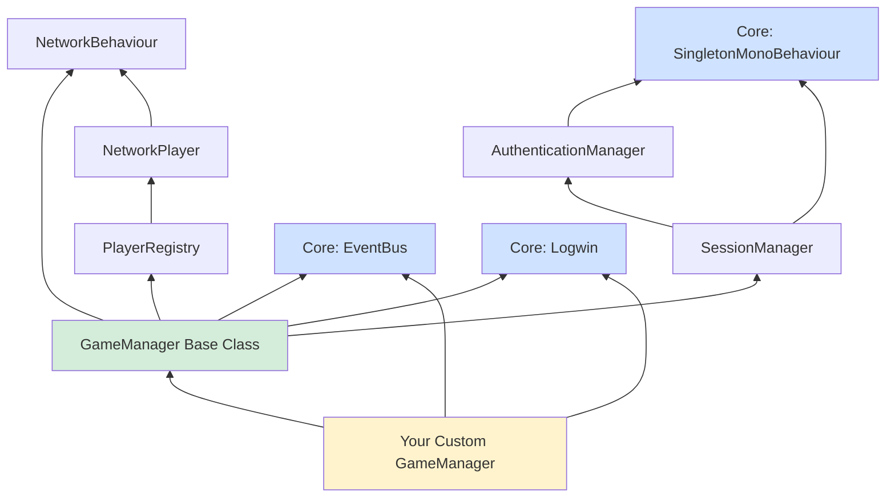
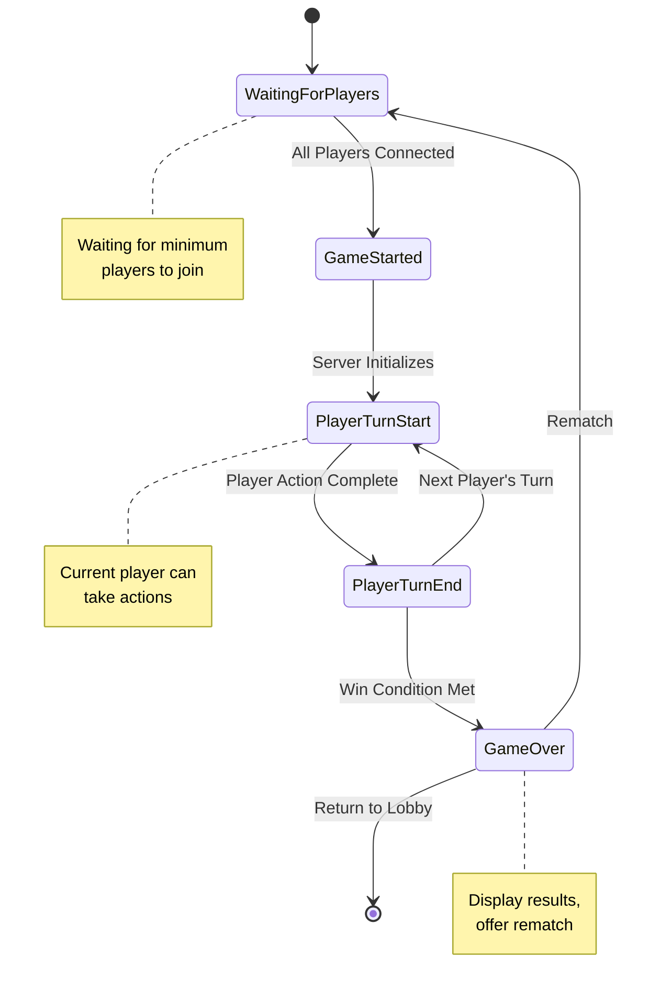
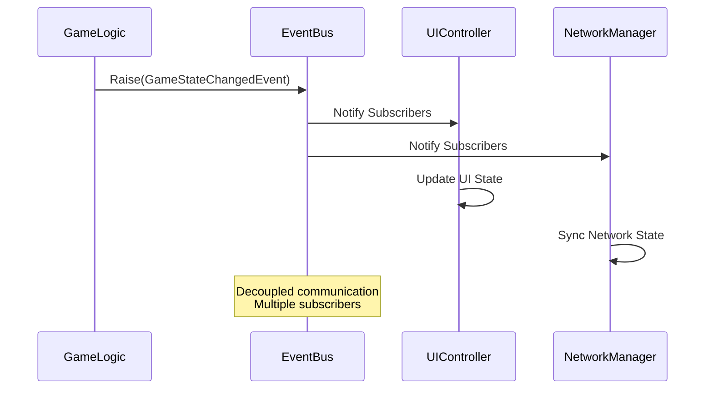
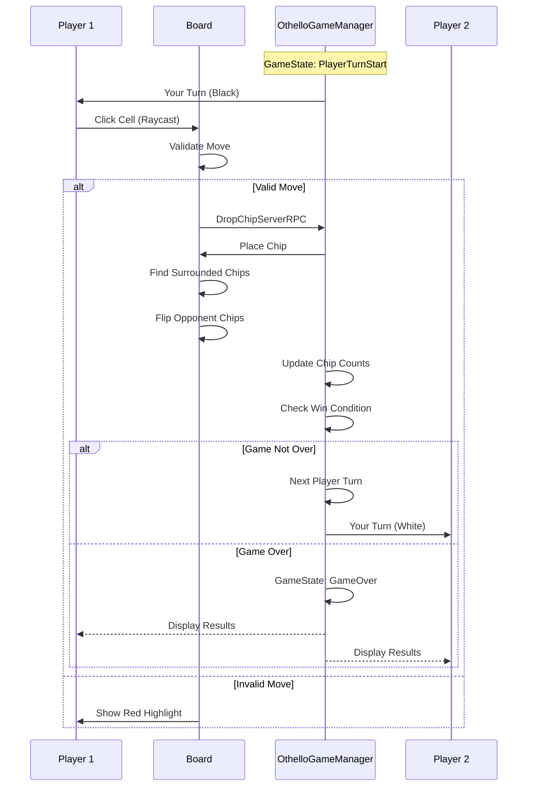
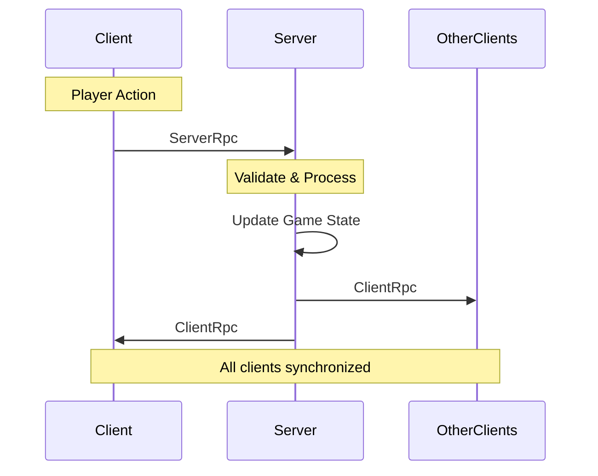

# Midnite Oil Software - Multiplayer Boilerplate


A complete multiplayer framework for Unity using [Netcode for GameObjects](https://docs-multiplayer.unity3d.com/netcode/current/about/), [Unity Gaming Services](https://unity.com/solutions/gaming-services) (Lobby, Relay, Authentication), and the Midnite Oil Software Core utilities.

This package provides everything you need to quickly build turn-based and real-time multiplayer games with authentication, lobby management, session handling, and network synchronization.

## 📖 Table of Contents

- [✨ Features](#-features)
- [📋 Requirements](#-requirements)
- [🚀 Installation](#-installation)
  - [Installation Flow](#installation-flow)
  - [Step 1: Install Core Package (Dependency)](#step-1-install-core-package-dependency)
  - [Step 2: Install Multiplayer Package](#step-2-install-multiplayer-package)
  - [Step 3: Import Othello Sample (Optional but Recommended)](#step-3-import-othello-sample-optional-but-recommended)
- [🎮 Quick Start](#-quick-start)
  - [1. Set Up Unity Gaming Services](#1-set-up-unity-gaming-services)
  - [2. Configure Build Settings](#2-configure-build-settings)
  - [3. Run the Demo](#3-run-the-demo)
- [🏗️ Architecture](#️-architecture)
  - [Framework Flow](#framework-flow)
  - [Dependency Hierarchy](#dependency-hierarchy)
  - [Game State Machine](#game-state-machine)
  - [Event-Driven Communication](#event-driven-communication)
- [📦 What's Included](#-whats-included)
  - [Core Components](#core-components)
  - [Sample: Othello Complete Game](#sample-othello-complete-game)
- [🔧 Building Your Own Multiplayer Game](#-building-your-own-multiplayer-game)
  - [1. Create Your Game Manager](#1-create-your-game-manager)
  - [2. Create Custom Events](#2-create-custom-events)
  - [3. Use Network Synchronization](#3-use-network-synchronization)
  - [4. Player Management](#4-player-management)
  - [5. Using Core Utilities](#5-using-core-utilities)
- [🗂️ Package Structure](#️-package-structure)
- [🎓 Best Practices](#-best-practices)
  - [Server Authoritative Design](#server-authoritative-design)
  - [Event Cleanup](#event-cleanup)
  - [Network Ownership](#network-ownership)
  - [Use NetworkVariables Wisely](#use-networkvariables-wisely)
- [🤝 Dependencies](#-dependencies)
- [🐛 Troubleshooting](#-troubleshooting)
  - [Common Issues](#common-issues)
- [📚 Documentation](#-documentation)
  - [Unity Documentation](#unity-documentation)
  - [Helpful Resources](#helpful-resources)
- [🔄 Version History](#-version-history)
- [📝 License](#-license)
- [🙏 Credits](#-credits)
- [💬 Support](#-support)
- [🌟 Show Your Support](#-show-your-support)


## ✨ Features

- 🎮 **Complete Multiplayer Framework** - Built on Netcode for GameObjects
- 🔐 **Authentication System** - Anonymous and username/password authentication via Unity Gaming Services
- 🎯 **Lobby Management** - Create, browse, and join game sessions
- 🌐 **Relay Integration** - NAT traversal for peer-to-peer connections
- 🎲 **Turn-Based Game Support** - Base classes for turn-based multiplayer games
- 📡 **Network Synchronization** - Patterns for NetworkVariables and RPCs
- 🎨 **Ready-to-Use UI** - Main menu, lobby browser, and authentication panels
- 📦 **Complete Sample Game** - Full Othello/Reversi implementation
- 🧩 **Event-Driven Architecture** - Using EventBus for decoupled communication

## 📋 Requirements

- **Unity 6000.0 or later**
- **[Midnite Oil Software Core Package](https://github.com/Midnite-Oil-Software-L-L-C/unity_packages/tree/main/Core)**
- **Unity Gaming Services** account (free tier available)

## 🚀 Installation

### Installation Flow



### Step 1: Install Core Package (Dependency)

The Multiplayer package requires the Core package. Install it first:

1. Open Unity and go to `Window > Package Manager`
2. Click the "**+**" button and choose `Add package from git URL`
3. Enter: [https://github.com/Midnite-Oil-Software-L-L-C/unity_packages.git?path=/Core](https://github.com/Midnite-Oil-Software-L-L-C/unity_packages.git?path=/Core)
4. Click `Add` and wait for installation to complete

### Step 2: Install Multiplayer Package

1. In Package Manager, click the "**+**" button again
2. Choose `Add package from git URL`
3. Enter: [https://github.com/Midnite-Oil-Software-L-L-C/unity_packages.git?path=/Multiplayer](https://github.com/Midnite-Oil-Software-L-L-C/unity_packages.git?path=/Multiplayer)
4. Click `Add` and wait for installation to complete

### Step 3: Import Othello Sample (Optional but Recommended)

1. In Package Manager, find **"Midnite Oil Software Multiplayer Boilerplate"**
2. Expand the **Samples** section
3. Click **Import** next to "Othello Complete Game"

## 🎮 Quick Start

### 1. Set Up Unity Gaming Services

1. Create a Unity account at [unity.com](https://unity.com) (if you don't have one)
2. In Unity Editor, go to `Edit > Project Settings > Services`
3. Link your project to a Unity Organization
4. Enable the following services in the [Unity Dashboard](https://dashboard.unity3d.com):
   - **Authentication**
   - **Lobby**
   - **Relay**

### 2. Configure Build Settings

1. Go to `File > Build Settings`
2. Add these scenes in order:
   - `Packages/Midnite Oil Software Multiplayer Boilerplate/Runtime/Scenes/Bootstrapper.unity`
   - `Packages/Midnite Oil Software Multiplayer Boilerplate/Runtime/Scenes/Main Menu.unity`
   - (Optional) `Assets/Samples/.../Othello.unity` (if you imported the sample)

### 3. Run the Demo

1. Press Play in the Unity Editor
2. Sign in using anonymous authentication
3. Create a lobby or join an existing one
4. (If using Othello sample) Start the game and play!

## 🏗️ Architecture

### Framework Flow



### Dependency Hierarchy



### Game State Machine



### Event-Driven Communication



## 📦 What's Included

### Core Components

#### Scene Management
- **Bootstrapper** - Application entry point with automatic initialization
  - `RuntimeInitializeOnLoadMethod` ensures scene loads before any other
  - Initializes Unity Services
  - Persists across scene loads (DontDestroyOnLoad)
- **ProjectSceneManager** - Scene loading and transition management

#### Authentication
- **AuthenticationManager** - Handles Unity Authentication (anonymous & username/password)
  - Singleton pattern for global access
  - Manages player ID and player name
  - Exposes authentication events
- **AuthenticationPanelUI** - Ready-to-use authentication UI
- **AnonymousLoginDialog** - Quick anonymous sign-in dialog
- **UsernameAndPasswordAuthenticationDialog** - Account-based authentication dialog

#### Session & Lobby Management
- **SessionManager** - Create, join, and manage multiplayer sessions
  - Integration with Unity Lobby Service
  - Relay network allocation (NAT traversal)
  - Session lifecycle management
- **GameSessionManager** - Game-specific session lifecycle management
- **LobbyListPanel** - Browse available game sessions
- **CurrentLobbyPanel** - Manage current session and players
- **LobbyPlayerPanel** - Display player status in lobbies

#### Networking
- **NetworkPlayer** - Base class for networked player representation
  - Extends NetworkBehaviour
  - Synchronized player properties
  - Player identification across network
- **PlayerRegistry** - Centralized player tracking across clients
  - Maintains list of all connected players
  - Local player reference
  - Player join/leave events
- **PlayerConnectionsManager** - Handle player connections and spawning
  - Connection approval
  - Player prefab spawning
  - Disconnection cleanup
- **GameStarter** - Orchestrate game initialization

#### Game Framework
- **GameManager** - Base class for game state management with turn-based support
  - State machine implementation
  - Turn management
  - NetworkVariable synchronization
  - Server authoritative design
  - Event-driven state changes
- **GameSessionInitializer** - Initialize game-specific session data
- **GameSessionCleanup** - Clean up session resources
- **SingletonNetworkBehavior** - Network-enabled singleton pattern

#### Events

All events use struct-based design for zero heap allocation:

- **GameStateChangedEvent** - Game state transitions
- **LeftGameEvent** - Player leaving game
- **MultiplayerEvents** - Network connection events
- **PlayerTurnStartEvent** - Turn start notification
- **PlayerTurnEndEvent** - Turn end notification

#### UI Components
- **MainMenuUI** - Main menu controller
- **ConfirmOrCancel** - Reusable confirmation dialogs
- **DynamicInputFieldWithConfirmButton** - Input with validation
- **TabNavigation** - Keyboard navigation for UI
- **QuitOnEscape** - ESC key handling

### Sample: Othello Complete Game

A fully functional multiplayer Othello (Reversi) game demonstrating all framework features:

#### Features
- ✅ Complete game logic with move validation
- ✅ 8-directional chip flipping algorithm
- ✅ Network-synchronized game board
- ✅ Turn-based gameplay
- ✅ Pass and resign functionality
- ✅ Rematch system
- ✅ Game UI with chip counters and turn indicators
- ✅ Visual feedback for valid/invalid moves
- ✅ Server-authoritative game state

#### Components
- **OthelloGameManager** - Extends GameManager for Othello-specific logic
  - Manages player chip colors using NetworkList
  - Tracks player pass state
  - Handles turn transitions and game over conditions
  
- **OthelloBoard** - Board logic and input handling
  - 8x8 grid procedural generation
  - Move validation (8-directional scanning)
  - Input System integration with raycasting
  - Network synchronization via RPCs
  
- **OthelloPlayer** - Player representation extending NetworkPlayer
  - Chip color assignment
  - Player-specific game state
  
- **Cell** - Board cell component
  - Position tracking (X, Y coordinates)
  - Chip reference management
  - Visual highlighting for valid/invalid moves
  - Material swapping for feedback
  
- **Chip** - Game piece with flip animation
  - Color property (Black/White)
  - Smooth flip animation
  - Visual representation
  
- **GameUI** - User interface controller
  - Turn indicator display
  - Real-time chip count tracking
  - Pass/Resign buttons
  - Game over screen with winner announcement
  - Rematch functionality

#### Othello Game Flow



See the sample's README for detailed documentation.

## 🔧 Building Your Own Multiplayer Game

### 1. Create Your Game Manager

Extend the `GameManager` base class to implement your game logic:

```csharp
using MidniteOilSoftware.Multiplayer;
using Unity.Netcode;

public class MyGameManager : GameManager
{
    // NetworkVariables for synchronized state
    NetworkVariable<int> _currentRound = new();
    
    public override void OnNetworkSpawn()
    {
        base.OnNetworkSpawn();
        
        if (IsServer)
        {
            // Server-only initialization
            _currentRound.Value = 1;
        }
    }
    
    protected override void ServerOnlyHandleGameStateChange()
    {
        base.ServerOnlyHandleGameStateChange();
        
        switch (CurrentState)
        {
            case GameState.GameStarted:
                InitializeGame();
                break;
                
            case GameState.PlayerTurnStart:
                HandleTurnStart();
                break;
                
            case GameState.PlayerTurnEnd:
                HandleTurnEnd();
                break;
                
            case GameState.GameOver:
                HandleGameOver();
                break;
        }
    }
    
    protected override bool IsGameOver()
    {
        // Implement your win condition
        return _currentRound.Value > 10;
    }
    
    void InitializeGame()
    {
        // Set up your game board, pieces, etc.
    }
    
    void HandleTurnStart()
    {
        // Notify current player, enable input, etc.
    }
    
    void HandleTurnEnd()
    {
        // Process turn results, advance to next player
        AdvanceToNextPlayer();
    }
    
    void HandleGameOver()
    {
        // Calculate winner, show results
    }
}
```

### 2. Create Custom Events

Use struct-based events for performance:

```csharp
using MidniteOilSoftware.Core;

// Define the event (zero heap allocation)
public struct PlayerScoredEvent
{
    public readonly int PlayerId;
    public readonly int Points;
    
    public PlayerScoredEvent(int playerId, int points)
    {
        PlayerId = playerId;
        Points = points;
    }
}

// Raise the event
EventBus.Instance.Raise(new PlayerScoredEvent(0, 100));

// Subscribe to the event (in OnEnable)
void OnEnable()
{
    EventBus.Instance.Subscribe<PlayerScoredEvent>(HandlePlayerScored);
}

// Unsubscribe (in OnDisable)
void OnDisable()
{
    EventBus.Instance.Unsubscribe<PlayerScoredEvent>(HandlePlayerScored);
}

// Handle the event
void HandlePlayerScored(PlayerScoredEvent e)
{
    Logwin.Log($"Player {e.PlayerId} scored {e.Points} points!");
    UpdateScoreUI(e.PlayerId, e.Points);
}
```

### 3. Use Network Synchronization

#### NetworkVariables

```csharp
using Unity.Netcode;

public class MyNetworkObject : NetworkBehaviour
{
    // Automatically synced across all clients
    NetworkVariable<int> _score = new(
        0, 
        NetworkVariableReadPermission.Everyone,
        NetworkVariableWritePermission.Server
    );
    
    // Subscribe to value changes
    public override void OnNetworkSpawn()
    {
        _score.OnValueChanged += OnScoreChanged;
    }
    
    void OnScoreChanged(int previousValue, int newValue)
    {
        Debug.Log($"Score changed from {previousValue} to {newValue}");
    }
}
```

#### Remote Procedure Calls (RPCs)



```csharp
public class MyNetworkObject : NetworkBehaviour
{
    // Client calls this, executes on server
    [Rpc(SendTo.Server)]
    void UpdateScoreServerRpc(int newScore, ServerRpcParams serverRpcParams = default)
    {
        // Validate the request (server authoritative)
        if (newScore < 0 || newScore > 1000)
        {
            Logwin.LogWarning("Invalid score received!");
            return;
        }
        
        // Update the score
        _score.Value = newScore;
        
        // Notify all clients
        DisplayScoreUpdateClientRpc(newScore);
    }
    
    // Server calls this, executes on all clients
    [Rpc(SendTo.ClientsAndHost)]
    void DisplayScoreUpdateClientRpc(string message)
    {
        // Update UI, play effects, etc.
        Debug.Log(message);
    }
    
    // Player clicks a button
    public void OnScoreButtonClicked()
    {
        // Only send RPC if we own this object
        if (IsOwner)
        {
            UpdateScoreServerRpc(100);
        }
    }
}
```

### 4. Player Management

```csharp
using MidniteOilSoftware.Multiplayer;

public class MyGameLogic : MonoBehaviour
{
    void Start()
    {
        // Get all connected players
        var allPlayers = PlayerRegistry.Instance.Players;
        
        // Get local player
        var localPlayer = PlayerRegistry.Instance.LocalPlayer;
        
        // Subscribe to player events
        EventBus.Instance.Subscribe<PlayerJoinedEvent>(OnPlayerJoined);
        EventBus.Instance.Subscribe<PlayerLeftEvent>(OnPlayerLeft);
    }
    
    void OnPlayerJoined(PlayerJoinedEvent e)
    {
        Logwin.Log($"Player {e.Player.PlayerName} joined!");
    }
    
    void OnPlayerLeft(PlayerLeftEvent e)
    {
        Logwin.Log($"Player left the game");
    }
}
```

### 5. Using Core Utilities

#### Logwin (Debug Logging)

```csharp
using MidniteOilSoftware.Core;

public class MyScript : MonoBehaviour
{
    [SerializeField] bool _enableDebugLog = true;
    
    void Update()
    {
        if (_enableDebugLog)
        {
            Logwin.Log("MyScript", "This is a categorized log message");
            Logwin.LogWarning("MyScript", "This is a warning");
            Logwin.LogError("MyScript", "This is an error");
        }
    }
}
```

#### Singleton Pattern

```csharp
using MidniteOilSoftware.Core;

public class MyManager : SingletonMonoBehaviour<MyManager>
{
    public void DoSomething()
    {
        Logwin.Log("Manager doing something");
    }
}

// Access from anywhere
MyManager.Instance.DoSomething();
```

## 🗂️ Package Structure

```
Packages/
└── Midnite Oil Software Multiplayer Boilerplate/
    ├── Runtime/
    │   ├── Scenes/
    │   │   ├── Bootstrapper.unity
    │   │   └── Main Menu.unity
    │   ├── Scripts/
    │   │   ├── Authentication/
    │   │   ├── Events/
    │   │   ├── Game/
    │   │   ├── Lobby/
    │   │   ├── Multiplayer/
    │   │   └── UI/
    │   ├── Prefabs/
    │   └── Materials/
    ├── Samples~/
    │   └── Othello/
    │       ├── Scenes/
    │       ├── Scripts/
    │       ├── Prefabs/
    │       ├── Materials/
    │       ├── Models/
    │       ├── Textures/
    │       └── README.md
    ├── package.json
    └── README.md
```

## 🎓 Best Practices

### Server Authoritative Design

Always validate game actions on the server:

```csharp
[Rpc(SendTo.Server)]
void PlacePieceServerRpc(int x, int y)
{
    // ✅ GOOD: Validate on server
    if (!IsValidMove(x, y))
    {
        Logwin.LogWarning("Invalid move rejected");
        return;
    }
    
    PlacePiece(x, y);
}
```

### Event Cleanup

Always unsubscribe from events to prevent memory leaks:

```csharp
void OnEnable()
{
    EventBus.Instance.Subscribe<GameStateChangedEvent>(OnGameStateChanged);
}

void OnDisable()
{
    EventBus.Instance.Unsubscribe<GameStateChangedEvent>(OnGameStateChanged);
}
```

### Network Ownership

Check ownership before sending RPCs:

```csharp
if (IsOwner)
{
    // Only the owner can send this RPC
    DoSomethingServerRpc();
}
```

### Use NetworkVariables Wisely

```csharp
// ✅ GOOD: Primitive types, small structs
NetworkVariable<int> _score = new();
NetworkVariable<Vector3> _position = new();

// ❌ BAD: Large data, frequent changes
// Use RPCs for large data or infrequent updates
```

## 🤝 Dependencies

This package automatically installs the following dependencies:

| Package | Version | Purpose |
|---------|---------|---------|
| `com.midniteoilsoftware.core` | 1.6.0 | Core utilities (EventBus, Singleton, Logwin) |
| `com.unity.netcode.gameobjects` | 2.5.1 | Networking framework |
| `com.unity.services.multiplayer` | 1.1.8 | Unity Gaming Services integration |
| `com.unity.multiplayer.playmode` | 1.6.1 | Multiplayer testing tools |
| `com.unity.inputsystem` | 1.14.2 | New Input System |
| `com.unity.ugui` | 2.0.0 | Unity UI system |
| `com.unity.2d.sprite` | 1.0.0 | 2D sprite support |

## 🐛 Troubleshooting

### Common Issues

#### "Failed to initialize Unity Services"

**Solution**: Ensure you've linked your project to a Unity Organization in `Edit > Project Settings > Services`

#### "Cannot find SessionManager"

**Solution**: Make sure the Bootstrapper scene is the first scene in your build settings

#### Players can't connect

**Solution**: 
1. Verify Relay service is enabled in Unity Dashboard
2. Check that both players are authenticated
3. Ensure firewall isn't blocking connections

#### Sample won't import

**Solution**: 
1. Verify Core package is installed first
2. Update Package Manager cache: `Window > Package Manager > Advanced > Reset Packages to Defaults`

## 📚 Documentation

### Unity Documentation
- [Netcode for GameObjects](https://docs-multiplayer.unity3d.com/netcode/current/about/)
- [Unity Gaming Services](https://docs.unity.com/ugs/)
- [Lobby Service](https://docs.unity.com/ugs/manual/lobby/manual/unity-lobby-service)
- [Relay Service](https://docs.unity.com/ugs/manual/relay/manual/introduction)
- [Authentication Service](https://docs.unity.com/ugs/manual/authentication/manual/intro-unity-authentication)

### Helpful Resources
- [Netcode API Reference](https://docs.unity3d.com/Packages/com.unity.netcode.gameobjects@latest)
- [NetworkVariable Guide](https://docs-multiplayer.unity3d.com/netcode/current/basics/networkvariable/)
- [RPC Guide](https://docs-multiplayer.unity3d.com/netcode/current/advanced-topics/message-system/rpc/)

## 🔄 Version History

### v1.2.0 (Current)
- ✅ Added Othello complete game sample
- ✅ Added Core package dependency
- ✅ Updated to latest Unity package versions
- ✅ Improved documentation with examples

### v1.1.0
- Initial release with multiplayer framework
- Authentication system
- Lobby and session management
- Main menu and UI components

## 📝 License

This project is licensed under the MIT License.

```
MIT License

Copyright (c) 2025 Midnite Oil Software L.L.C.

Permission is hereby granted, free of charge, to any person obtaining a copy
of this software and associated documentation files (the "Software"), to deal
in the Software without restriction, including without limitation the rights
to use, copy, modify, merge, publish, distribute, sublicense, and/or sell
copies of the Software, and to permit persons to whom the Software is
furnished to do so, subject to the following conditions:

The above copyright notice and this permission notice shall be included in all
copies or substantial portions of the Software.

THE SOFTWARE IS PROVIDED "AS IS", WITHOUT WARRANTY OF ANY KIND, EXPRESS OR
IMPLIED, INCLUDING BUT NOT LIMITED TO THE WARRANTIES OF MERCHANTABILITY,
FITNESS FOR A PARTICULAR PURPOSE AND NONINFRINGEMENT. IN NO EVENT SHALL THE
AUTHORS OR COPYRIGHT HOLDERS BE LIABLE FOR ANY CLAIM, DAMAGES OR OTHER
LIABILITY, WHETHER IN AN ACTION OF CONTRACT, TORT OR OTHERWISE, ARISING FROM,
OUT OF OR IN CONNECTION WITH THE SOFTWARE OR THE USE OR OTHER DEALINGS IN THE
SOFTWARE.
```

## 🙏 Credits

**Created by**: [Midnite Oil Software L.L.C.](https://github.com/Midnite-Oil-Software-L-L-C)

**Built with**:
- Unity Technologies - Unity Engine and Netcode for GameObjects
- Unity Gaming Services - Authentication, Lobby, and Relay

## 💬 Support
- **Issues**: Report bugs or request features on our [GitHub Issues](https://github.com/Midnite-Oil-Software-L-L-C/

## 🌟 Show Your Support

If this package helped you build your multiplayer game, please consider:
- ⭐ Starring the repository
- 📢 Sharing it with other Unity developers
- 💬 Providing feedback and suggestions

---

**Happy Multiplayer Game Development!** 🎮🚀

*Made with ❤️ by Midnite Oil Software L.L.C.*
